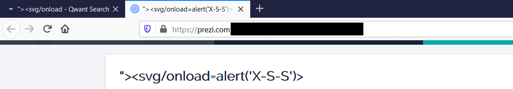
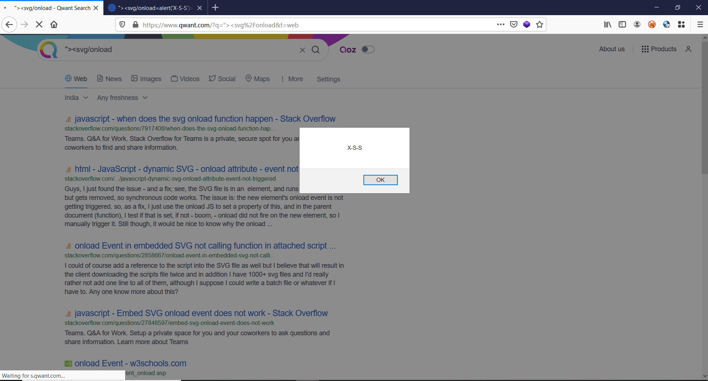

## **Overview**

Stored XSS vulnerability was found on Qwant search engine on February 2020 and was fixed in few hours after the triage

### Proof of Concept

1. Create a blog or website with XSS payload as a title name. I created account on [www.prezi.com](www.prezi.com) & add the blog with title as XSS payload.

2. Wait for few days to get your website crawl by the search engine crawler. It took 8 days to crawl & list the website on Qwant search engine crawler.
3. Search the website name.  As you can see XSS payload is executed on the browser.

